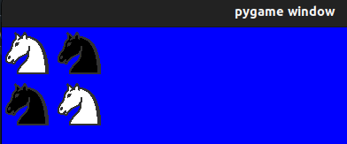

# web2_lab_04
<div align="center">
<table>
    <theader>
        <tr>
            <td></td>
            <th>
                <span style="font-weight:bold;">UNIVERSIDAD NACIONAL DE SAN AUGUSTIN</span><br />
                <span style="font-weight:bold;">FACULTAD DE INGENIERÍA DE PRODUCCIÓN Y SERVICIOS</span><br />
                <span style="font-weight:bold;">ESCUELA PROFESIONAL DE INGENIERÍA DE SISTEMAS</span>
            </th>
                  </tr>
    </theader>
    <tbody>
        <tr><td colspan="3"><span style="font-weight:bold;">Formato</span>: Guía del Estudiante / Talleres / Centros de Simulación</td></tr>
        <tr><td><span style="font-weight:bold;">Aprobación</span>:  2022/03/01</td><td><span style="font-weight:bold;">Código</span>: GUIA-PRLD-001</td><td><span style="font-weight:bold;">Página</span>: 1</td></tr>
    </tbody>
</table>
</div>

<div align="center">
<span style="font-weight:bold;">GUÍA DEL ESTUDIANTE</span><br />
<span>(formato del estudiante)</span>
</div>


<table>
<theader>
<tr><th colspan="6">INFORMACIÓN BÁSICA</th></tr>
</theader>
<tbody>
<tr><td>ASIGNATURA:</td><td colspan="5">Programación Web 2</td></tr>
<tr><td>TÍTULO DE LA PRÁCTICA:</td><td colspan="5">Practica 03</td></tr>
<tr>
<td>NÚMERO DE PRÁCTICA:</td><td>04</td><td>AÑO LECTIVO:</td><td>2022 A</td><td>NRO. SEMESTRE:</td><td>III</td>
</tr>
<tr>
<td>FECHA INICIO::</td><td>MAY-2022</td><td>FECHA FIN:</td><td>05-Jun-2022</td><td>DURACIÓN:</td><td>04 horas</td>
</tr>
<tr><td colspan="6">INTEGRANTES:
<ul>
<li>Cozco Mauri Yoset --------------------ycozco@unsa.edu.pe</li>
<li>César Alejandro Garay Bedregal--------cgarayb@unsa.edu.pe</li>
<li>Vladimir Sulla Quispe-----------------vsullaq@unsa.edu.pe</li>
</ul>
</td>
</<tr>
<tr><td colspan="6">DOCENTES:
<ul>
<li>Richart Smith Escobedo Quispe (rescobedoq@unsa.edu.pe)</li>
</ul>
</td>
</<tr>
</tdbody>
</table>


<table>
<theader>
<tr><th colspan="6">SOLUCIÓN Y RESULTADOS</th></tr>
</theader>
<tbody>
</tr>
<tr><td colspan="6">
<tr>
#I. SOLUCIÓN DE EJERCICIOS PROBLEMAS:
A. <br><br>
-   verticalMirror: Devuelve el espejo vertical de la imagen.
    
```python
    def verticalMirror(self):
        vertical = []
        for value in self.img:
            vertical.append(value[::-1])
        return Picture(vertical)
```
</tr>
<tr>
-   horizontalMirror: Devuelve el espejo horizontal de la imagen.

```python
  def horizontalMirror(self):
    horizontal = []
    for tmp  in self.img:
      horizontal.insert(0,tmp)
    return Picture(horizontal)
```
</tr><tr>
-   negative: Devuelve un negativo de la imagen.

```python
  def negative(self):
    negative = []
    iteration = '';
    for value in self.img:
      for char in value:
        iteration += self._invColor(char)
      negative.append(iteration)
      iteration = ''
    return Picture(negative)
```
</tr><tr>
-   join: Devuelve una nueva figura poniendo la figura del argumento al lado derecho de la figura actual.

```python
  def join(self, p):
    joined = []
    position = 0
    for tmp in self.img:
      joined.append(tmp + " " +p.img[position])
      position += 1
    return Picture(joined)
```
</tr><tr>
-   up: Devuelve una nueva figura poniendo la figura recibida como argumento, encima de la figura actual.

```python
  def up(self, p):
    image = self.img
    image.extend(p.img)
    return Picture(image)
```
</tr><tr>
-   under: Devuelve una nueva figura poniendo la figura recibida como argumento, sobre la figura actual.

```python
  def under(self, p):
    image = []
    for i in range(0, len(p.img)):
      line = ""
      for j in range(0, len(p.img[i])):
        if (p.img[i][j] == " "):
          line += self.img[i][j]
        else:
          line += p.img[i][j]
      image.append(line)
    return Picture(image)
```
</tr><tr>
-   horizontalRepeat, Devuelve una nueva figura repitiendo la figura actual al costado la cantidad de veces que indique el valor de n.

```python
  def horizontalRepeat(self, n):
    image = []	
    for i in range(0, len(self.img)):
      image.append(self.img[i] * n)
    return Picture(image)
```
</tr><tr>
-   verticalRepeat Devuelve una nueva figura repitiendo la figura actual debajo, la cantidad de veces que indique el valor de n

```python
  def verticalRepeat(self, n):
    VRepeat = []
    i = 0
    while i < n:
      i += 1
      for value in self.img:
        VRepeat.append(value)
    return Picture(VRepeat)
```
</tr><tr>
-   #Extra: Sólo para realmente viciosos 

```python
  def rotate(self):
    rotate = []
    i = 0
    for value in self.img:
      rotate.append(value[0]) # Este bucle hará que nuestro arreglo tenga el tamaño del arreglo de la figura
    while i < len(rotate):
      for value in self.img:
        rotate[i] += value[i]
      i += 1
    return Picture(rotate)
```
</tr>
B. Usando únicamente los métodos de los objetos de la clase Picture dibuje las siguientes figuras (invoque a draw):<br>

</td><tr>
## Ejercicio2 a)

```python
from interpreter import draw
from chessPictures import *
#Creo un Picture de la imagen del caballo negro
negativeK= knight.negative()
#Creo en un Picture la primera linea incluyendo un caballo y el caballo(negativo)
firstLine = knight.join(negativeK)
#Creo en un Picture la segunda liena incluyenda el caballo(negativo) y el caballo
secondLine = negativeK.join(knight)
#Usando la funcion up de Picture, creo un Picture con la primera linea y la segunda linea
result = firstLine.up(secondLine)
draw(result)
```


</tr><tr><br>
## Ejercicio2 b)

```python

```


</tr><tr><br>
## Ejercicio2 c)

```python

```


</tr><tr><br>
## Ejercicio2 d)

```python

```


</tr><tr><br>
## Ejercicio2 e)

```python

```


</tr><tr><br>
## Ejercicio2 f)

```python

```


</tr><tr><br>
## Ejercicio2 g)

```python

```


</tr>


<tr><td colspan="6">II. SOLUCIÓN DE CUESTIONARIO:
<ul>
<li>
</li>


</ul>
</td>
</<tr>
 
</tr>
<tr><td colspan="6">III. CONCLUSIONES:
<ul>
<li></li>

</td>
</<tr>

</tdbody>
</table>


<table>
<theader>
<tr><th colspan="6">RETROALIMENTACIÓN GENERAL</th></tr>
</theader>
<tbody>
</tr>
<tr><td colspan="6">
<ul>
<li><a </a></li>
<li><a </a></li>
<li><a </a></li>
</ul>
</td>
</<tr>
</tdbody>
</table>


<table>
<theader>
<tr><th colspan="6">REFERENCIAS BIBLIOGRÁFICAS</th></tr>
</theader>
<tbody>
</tr>
<tr><td colspan="6">
<ul>
<li></li>
<li></li>
<li></li>

<li></li>
</ul>
</td>
</<tr>
</tdbody>
</table>

